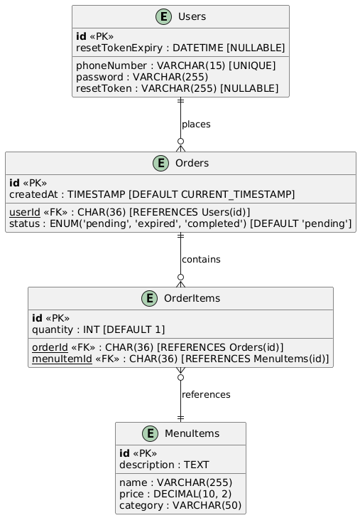

# SRMS (Serverless Restaurant Management System)

This project is a Serverless **Restaurant Management System** backend API built with **Node.js** and **Express**. It manages user authentication, orders, and password resets while leveraging modern tools like **Twilio** for SMS notifications and **MySQL** for persistent storage. The system is deployed using **Vercel** for serverless architecture.
- ## Tip: You can access the API's Swagger documentation using the endpoint /api-docs
## Features Implemented

### User Management
- **Password Reset Flow**
  - Generate a secure password reset token (using `crypto`).
  - Send reset links via **Twilio SMS** instead of emails.
  - Tokens expire after 1 hour.

- **Account Recovery**
  - Handle scenarios where users recover their accounts via phone verification.

- **CRUD Operations**
  - Add, update, and delete users.
  - Truncate user data while managing foreign key constraints in MySQL.

### Order Management
- **Auto Expiration of Orders**
  - Orders in "pending" status automatically update to "expired" after 4 hours.
  - Implemented via a cron job scheduled using `node-cron`.

- **Order Management CRUD**
  - Create and manage orders.
  - Delete users and cascade-delete their orders and related entries.

### Database Schema Changes
- Added **`phoneNumber`** column to the `users` table.
- Removed **`email`** column.
- Updated foreign key constraints to enable cascading deletes.

### Serverless Deployment
- **Vercel Deployment**
  - Serverless function for API endpoints.
  - Configured `vercel.json` for custom routing and serverless support.
  -  Deployed on Vercel: [SRMS on Vercel](https://geeky-air-lyart.vercel.app/test)
  - Database is hosted on [Filess.io](filess.io)

---

## Technologies Used
- **Backend**: Node.js, Express.js
- **Database**: MySQL
- **Deployment**: Vercel (Serverless Architecture)
- **Messaging**: Twilio (SMS API)
- **Task Scheduling**: node-cron
- **Security**: Crypto (for generating secure tokens)

---
### Entity-Relationship Diagram (ERD)



---

## Installation and Setup

### 1. Prerequisites
Ensure you have the following installed:
- Node.js (v14+)
- MySQL Database
- Vercel CLI (optional, for deployment)

### 2. Clone the Repository
```bash
git clone https://github.com/MohamedWElteir/GeekyAir/
cd server.js
```

### 3. Install Dependencies
```bash
npm install
```

### 4. Configure Environment Variables
Create a `.env` file in the root directory and add the following variables:
```plaintext
# Database Configuration
DB_HOST=your-database-host
DB_USER=your-database-user
DB_PASSWORD=your-database-password
DB_NAME=your-database-name

# Twilio Configuration
TWILIO_ACCOUNT_SID=your-twilio-account-sid
TWILIO_AUTH_TOKEN=your-twilio-auth-token
TWILIO_PHONE_NUMBER=your-twilio-phone-number

# Client URL
CLIENT_URL=https://your-client-url
```

### 5. Database Setup
Run the following SQL script to set up the database tables:
```sql
CREATE TABLE users (
  id CHAR(36) PRIMARY KEY,
  phoneNumber VARCHAR(15) NOT NULL,
  password VARCHAR(255) NOT NULL,
  resetToken VARCHAR(255),
  resetTokenExpiry DATETIME
);

CREATE TABLE orders (
  id CHAR(36) PRIMARY KEY,
  userId CHAR(36),
  status ENUM('pending', 'expired', 'completed') DEFAULT 'pending',
  createdAt TIMESTAMP DEFAULT CURRENT_TIMESTAMP,
  FOREIGN KEY (userId) REFERENCES users(id) ON DELETE CASCADE
);

CREATE TABLE orderitems (
  id CHAR(36) PRIMARY KEY,
  orderId CHAR(36),
  menuItemId CHAR(36),
  quantity INT DEFAULT 1,
  FOREIGN KEY (orderId) REFERENCES orders(id) ON DELETE CASCADE
);
```

### 6. Run the Application
Start the server locally:
```bash
npm start
```

Or use Vercel for local testing:
```bash
vercel dev
```

---

## Password Reset Flow
1. User requests a password reset by providing their phone number.
2. A secure reset token is generated and saved to the database.
3. Twilio sends an SMS to the user containing the password reset link.
4. User clicks the link and sets a new password.

---

## Cron Job for Auto-Expiration of Orders
The system runs a scheduled cron job every hour to automatically expire orders older than 4 hours:
```javascript
cron.schedule('0 * * * *', () => {
    console.log('Running cron job to update expired orders...');
    updateExpiredOrders();
});
```

---

## Deployment
To deploy your project to Vercel:
1. Install Vercel CLI:
   ```bash
   npm install -g vercel
   ```
2. Deploy your project:
   ```bash
   vercel
   ```
3. Follow the prompts and ensure your environment variables are added via Vercel Dashboard.

### Vercel Configuration (`vercel.json`):
```json
{
  "version": 2,
  "builds": [
    {
      "src": "index.js",
      "use": "@vercel/node"
    }
  ],
  "routes": [
    {
      "src": "/(.*)",
      "dest": "index.js"
    }
  ]
}
```

---

## API Endpoints

### 1. Request Password Reset
**POST** `/api/reset-password/request`
```json
{
  "phoneNumber": "+1234567890"
}
```
**Response**:
```json
{
  "message": "Password reset SMS sent successfully."
}
```

### 2. Reset Password
**POST** `/api/reset-password`
```json
{
  "token": "reset-token",
  "newPassword": "securepassword123"
}
```
**Response**:
```json
{
  "message": "Password reset successful."
}
```

---

## Testing
1. Use **Postman** to test the API endpoints.
2. Check Twilio logs to verify SMS delivery.
3. Confirm database changes using MySQL.

---

## Future Improvements
- Implement two-factor authentication (2FA).
- Add more role-based access controls.
- Enhance error handling and validation.

---

